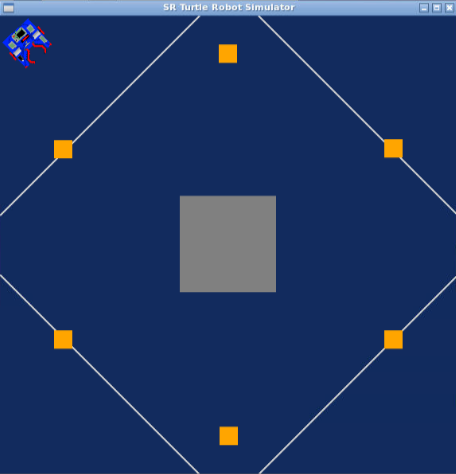
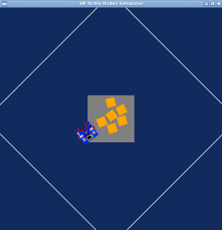

### Research_Track1_First_Assignment 

The goal of this assignment is to gather all the golden boxes in the centeral location next to each other.


> Figure1 - First configuration of the the robot


> Figure2 - Final configuration of the robot

Installing&running
----------------------
The simulator requires a Python 2.7 installation, the [pygame](http://pygame.org/) library, [PyPyBox2D](https://pypi.python.org/pypi/pypybox2d/2.1-r331), and [PyYAML](https://pypi.python.org/pypi/PyYAML/). Pygame, unfortunately, can be tricky (though [not impossible](http://askubuntu.com/q/312767)) to install in virtual environments. If you are using `pip`, you might try `pip install hg+https://bitbucket.org/pygame/pygame`, or you could use your operating system's package manager. Windows users could use [Portable Python](http://portablepython.com/). PyPyBox2D and PyYAML are more forgiving, and should install just fine using `pip` or `easy_install`.

## Exercise
-----------------------------

To run one or more scripts in the simulator, use `run.py`, passing it the file names. 

you can run the program with:

```bash
$ python2 run.py assignment.py
```

## Troubleshooting

When running `python run.py <file>`, you may be presented with an error: `ImportError: No module named 'robot'`. This may be due to a conflict between sr.tools and sr.robot. To resolve, symlink simulator/sr/robot to the location of sr.tools.

On Ubuntu, this can be accomplished by:
* Find the location of srtools: `pip show sr.tools`
* Get the location. In my case this was `/usr/local/lib/python2.7/dist-packages`
* Create symlink: `ln -s path/to/simulator/sr/robot /usr/local/lib/python2.7/dist-packages/sr/`


Robot_API
---------

The API for controlling a simulated robot is designed to be as similar as possible to the [SR API][sr-api].

### Motors ###

The simulated robot has two motors configured for skid steering, connected to a two-output [Motor Board](https://studentrobotics.org/docs/kit/motor_board). The left motor is connected to output `0` and the right motor to output `1`.

The Motor Board API is identical to that of the [SR API](https://studentrobotics.org/docs/programming/sr/motors/), except that motor boards cannot be addressed by serial number. So, to turn on the spot at one quarter of full power, one might write the following:

```python
R.motors[0].m0.power = 25
R.motors[0].m1.power = -25
```

### Grabber ###

The robot is equipped with a grabber, capable of picking up a token which is in front of the robot and within 0.4 metres of the robot's centre. To pick up a token, call the `R.grab` method:

```python
success = robot.grab()
```

The `robot.grab` function returns `True` if a token was successfully picked up, or `False` otherwise. If the robot is already holding a token, it will throw an `AlreadyHoldingSomethingException`.

To drop the token, call the `robot.release` method.

### Vision ###

To help the robot find tokens and navigate, each token has markers stuck to it, as does each wall. The `R.see` method returns a list of all the markers the robot can see, as `Marker` objects. The robot can only see markers which it is facing towards.

Each `Marker` object has the following attributes:

* `info`: a `MarkerInfo` object describing the marker itself. Has the following attributes:
  * `code`: the numeric code of the marker.
  * `marker_type`: the type of object the marker is attached to (either `MARKER_TOKEN_GOLD`, `MARKER_TOKEN_SILVER` or `MARKER_ARENA`).
  * `offset`: offset of the numeric code of the marker from the lowest numbered marker of its type. For example, token number 3 has the code 43, but offset 3.
  * `size`: the size that the marker would be in the real game, for compatibility with the SR API.
* `centre`: the location of the marker in polar coordinates, as a `PolarCoord` object. Has the following attributes:
  * `length`: the distance from the centre of the robot to the object (in metres).
  * `rot_y`: rotation about the Y axis in degrees.
* `dist`: an alias for `centre.length`
* `res`: the value of the `res` parameter of `robot.see`, for compatibility with the SR API.
* `rot_y`: an alias for `centre.rot_y`
* `timestamp`: the time at which the marker was seen (when `robot.see` was called).

For example, the following code lists all of the markers the robot can see:

```python
markers = robot.see()
print "I can see", len(markers), "markers:"

for m in markers:
    if m.info.marker_type in (MARKER_TOKEN_GOLD, MARKER_TOKEN_SILVER):
        print " - Token {0} is {1} metres away".format( m.info.offset, m.dist )
    elif m.info.marker_type == MARKER_ARENA:
        print " - Arena marker {0} is {1} metres away".format( m.info.offset, m.dist )
```
The Code
----------------------
Initially, two threshold values are established: ORIENTATION_THRESHOLD for angle and DISTANCE_THRESHOLD for distance. These thresholds assist the robot in determining when it has approached sufficiently close to the target for grasping.

Additionally, an empty list called grabbed_boxes is created. This list is used to store the codes of boxes that have been moved. By doing this, the robot can identify which boxes have already been relocated, allowing it to focus on locating and grabbing new boxes.

The defined functions are as follows:

- drive(speed, seconds)
- turn(speed, seconds)
- def find_closest_marker(marker_type, condition_func):
- find_closest_gold()
- find_release_location()
- grab_gold()
- release_grabbed_gold()

### drive ###
the drive(speed, seconds) function was created to allow the robot to move straight. It get two inputs: `speed` and `seconds`. It will move with the power `speed` for a duration of `seconds`. it can go forward, giving to `speed` parameter a positive value, or it can go backward giving to `speed` parameter a negative value.
- speed: the linear velocity that we want the robot to assume. 
- seconds: the amount of seconds we want to drive.

```python
def drive(speed, seconds):
    robot.motors[0].m0.power = speed
    robot.motors[0].m1.power = speed
    time.sleep(seconds)
    robot.motors[0].m0.power = 0
    robot.motors[0].m1.power = 0
```

### turn ###

The turn(speed, seconds) functions give the robot the ability to spin around itself. It's done by giving the right and left motors equal speeds with different signs. It get two inputs: `speed` and `seconds`. It will move with the power `speed` for a duration of `seconds`.

```python
def turn(speed, seconds):
    robot.motors[0].m0.power = speed
    robot.motors[0].m1.power = -speed
    time.sleep(seconds)
    robot.motors[0].m0.power = 0
    robot.motors[0].m1.power = 0
```
### find_closest_marker ###

This function searches for the closest marker of a specified type (marker_type) that meets a certain condition (condition_func). It iterates through visible markers, checking their distance and type, and returns the distance, rotation, and code of the closest marker that matches the criteria. If no marker matches, it returns -1 for all values.

 ```python
def find_closest_marker(marker_type, condition_func):
    min_distance = 100
    for box in robot.see():
        if (
            box.dist < min_distance
            and box.info.marker_type == marker_type
            and condition_func(box)
        ):
            min_distance = box.dist
            rot_y = box.rot_y
            code = box.info.code

    if min_distance == 100:
        return -1, -1, -1
    else:
        return min_distance, rot_y, code
```
### find_closest_gold ###

This function is a specialized use of find_closest_marker to find the closest golden box. It uses a condition function to filter out boxes that have already been grabbed (stored in grabbed_boxes).

```python
def find_closest_gold():
    def condition(box):
        return box.info.code not in grabbed_boxes

    return find_closest_marker(MARKER_TOKEN_GOLD, condition)
```
### find_release_location ###

This function is Similar to find_closest_gold, but it looks for a location to release a grabbed golden box. It finds the closest marker where a box can be released, using the list of grabbed boxes to determine valid release locations.

```python
def find_release_location():
    def condition(box):
        return box.info.code in grabbed_boxes

    return find_closest_marker(MARKER_TOKEN_GOLD, condition)
```


### grab_gold ###
This function controls the robot to move towards the closest golden box. It continuously adjusts the robot's orientation and moves forward until the robot is close enough to the box (within a defined distance threshold). Once close enough, the loop breaks, indicating the robot is in position to grab the box.

```python
def grab_gold():
    while True:
        dist, rot_y, code = find_closest_gold()

        if dist <= DISTANCE_THRESHOLD:
            print("Found a gold box!")
            break
        elif -ORIENTATION_THRESHOLD <= rot_y <= ORIENTATION_THRESHOLD:
            print("Moving forward.")
            drive(15, 0.33)
        elif rot_y < -ORIENTATION_THRESHOLD:
            print("Adjusting left.")
            turn(-3, 0.33)
        elif rot_y > ORIENTATION_THRESHOLD:
            print("Adjusting right.")
            turn(3, 0.33)
```

### release_grabbed_gold ###

This function should presumably control the robot to release a grabbed golden box. However, the contents of the function were truncated in the output. Based on the naming convention and the context of other functions, it likely involves moving the robot to a release location and then executing the release mechanism.

```python
def release_grabbed_gold():
    while True:
        dist, rot_y, code = find_release_location()

        if dist < DISTANCE_THRESHOLD + 0.2:
            print("Found a drop location!")
            break
        elif -ORIENTATION_THRESHOLD <= rot_y <= ORIENTATION_THRESHOLD:
            print("Moving forward.")
            drive(15, 0.33)
        elif rot_y < -ORIENTATION_THRESHOLD:
            print("Adjusting left.")
            turn(-3, 0.33)
        elif rot_y > ORIENTATION_THRESHOLD:
            print("Adjusting right.")
            turn(3, 0.33)
```
### Main Algorithm ###

After detailing the functions in the preceding section, we're now equipped to outline the core algorithm enabling the robot to seize and consolidate all the golden boxes into a single location. Initially, the robot identifies the nearest golden box, designating it as the primary reference box. Subsequently, each successive box is deposited at this reference box's location. However, this spot may not remain the reference for all subsequent boxes, as the robot aims to find the nearest feasible drop-off point.

A scenario may arise where the robot is unable to detect any golden box in its vicinity (indicated by dist = -1). In such instances, the robot persists in rotating and searching until a golden box is located. The programming for this particular segment is detailed below:

```python
dist, rot_y, code = find_closest_gold()
    while dist == -1:
        print("Searching for a gold box...")
        turn(-10, 1)
        dist, rot_y, code = find_closest_gold()
```
Once the box is located, the robot approaches it using the grab_gold() function and secures the box with the robot.grab() method. The box is then released at a random location. Following the box's release, its identifier is recorded in the grabbed_boxes list. To prevent colliding with the recently deposited box, the robot then retreats and executes a turn:

```python

 grab_gold()
    robot.grab()
    print("Successfully grabbed the box.")
    turn(-20, 0.7)
    drive(20, 10)
    robot.release()
    print("Package delivered.")
    drive(-15, 1.33)
    turn(30, 2)
    grabbed_boxes.append(code)

```
Subsequently, a while loop is implemented, enabling the robot to navigate towards and collect the remaining boxes, placing them adjacent to one another. Upon depositing each box, its identifier is appended to the `grabbed_boxes` list, after which a new search is initiated.

```python
  while len(grabbed_boxes) < 6:
        dist, rot_y, code = find_closest_gold()
        while dist == -1:
            print("Searching for a gold box...")
            turn(-10, 1)
            dist, rot_y, code = find_closest_gold()
        grab_gold()
        robot.grab()
        print("Successfully grabbed the box.")
        new_dist, new_rot_y, new_code = find_release_location()
        while new_dist == -1:
            print("Searching for a drop location...")
            turn(10, 1)
            new_dist, new_rot_y, new_code = find_release_location()
        release_grabbed_gold()
        robot.release()
        print("Package delivered.")
        drive(-15, 1.33)
        turn(30, 2)
        grabbed_boxes.append(new_code)

```
